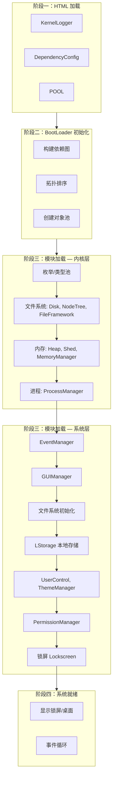

# 1.12.3 流程图解析

## 本节导读

本节给出 ZerOS 系统启动的**完整流程图**，并对图中每一阶段进行解读，使读者仅凭本章即可建立对启动流程的整体认识（图书自闭合）。流程图采用 Mermaid 绘制，支持在支持 Mermaid 的 Markdown 预览或文档站点中直接渲染；图中节点与 1.1～1.11 各节模块一一对应。

---

## ZerOS 系统启动流程图

下图描述从页面加载到系统就绪的完整过程。自上而下表示时间顺序；同一层级内的模块可能并行加载（由 BootLoader 的拓扑序与实现决定）。

**图 1-1 ZerOS 系统启动流程图**

---

## 流程图说明

以下按图中四个阶段逐段说明，并与前文各节对应，便于对照阅读。

### 阶段一：HTML 加载

- **图中含义**：页面加载时，浏览器按 HTML 中的 `<script>` 顺序加载并执行脚本。ZerOS 将**核心基础模块**放在最前面，确保在 BootLoader 逻辑运行前就已就绪。
- **节点对应**：
  - **KernelLogger**：对应 1.2 节，日志系统最先就绪，供后续所有模块打日志。
  - **DependencyConfig**：对应 1.3 节，依赖配置的代码与数据结构就绪，供 BootLoader 构建依赖图。
  - **POOL**：对应 1.4 节，对象池的代码就绪，BootLoader 将在下一阶段创建实例并注册早期对象。
- **注意**：本阶段仅“脚本加载并执行”，各模块的**初始化逻辑**（如创建单例、注册到 POOL）可能在下一阶段由 BootLoader 触发，具体以源码为准。图中将三者并列表示“均在 HTML 阶段就绪”。

### 阶段二：BootLoader 初始化

- **图中含义**：BootLoader（即加载 starter.js 后的入口逻辑）开始执行，完成两件事：根据依赖声明构建依赖图并计算加载顺序；创建全局对象池实例。
- **节点对应**：
  - **构建依赖图**：对应 1.3 节，读取各模块的依赖声明（如 MODULE_DEPENDENCIES），得到“谁依赖谁”的有向图。
  - **拓扑排序**：对应 1.5 节，按拓扑序确定模块加载顺序，保证被依赖者先于依赖者加载。
  - **创建对象池**：对应 1.4 节，创建 KERNEL_GLOBAL_POOL 等全局池，并可能注册引导期共享对象。
- **产出**：依赖顺序已知、对象池可用；随后进入“按序加载模块”阶段。

### 阶段三：模块加载（内核层 → 系统层）

图中将本阶段拆为**内核层**与**系统层**两块，与 1.1.7 的“三层架构”对应；实际加载顺序由依赖图与拓扑排序决定，可能有多层交错（如文件系统初始化依赖 Disk/NodeTree，本地存储又依赖文件系统初始化）。

- **内核层**（与 1.6、1.7、1.8 对应）：
  - **枚举/类型池**：类型与枚举等基础定义，供文件类型、地址类型等使用。
  - **文件系统**：Disk、NodeTree、FileFramework 等，对应 1.8 节；提供目录树与文件抽象。
  - **内存**：Heap、Shed、MemoryManager，对应 1.7 节；提供堆/栈与内存管理。
  - **进程**：ProcessManager，对应 1.6 节；提供进程创建、调度与生命周期。
- **系统层**（与 1.9、1.10、1.11 对应）：
  - **EventManager**：对应 1.11 节，事件系统需在依赖进程管理等模块后加载，以便各 UI 与业务模块订阅事件。
  - **GUIManager**：对应 1.10 节，窗口管理依赖进程与事件。
  - **文件系统初始化**：将磁盘、节点树、文件框架挂接到实际存储（如后端或本地），完成文件系统可用状态。
  - **LStorage**：本地存储管理器，依赖文件系统与初始化结果，为配置、用户数据等提供持久化。
  - **UserControl / ThemeManager / PermissionManager**：对应 1.9 节，用户、主题与权限在本地存储就绪后加载。
  - **锁屏（Lockscreen）**：依赖用户与权限，作为启动流程的“最后一屏”，用户登录后进入桌面。

同一层级内多个模块若无依赖关系，可由加载器并行加载；图中用箭头表示“依赖/顺序”关系，不表示唯一串行。

### 阶段四：系统就绪

- **图中含义**：所有在依赖图中声明的模块加载并初始化完成后，BootLoader 认为系统已就绪；随后显示锁屏或桌面，事件系统进入事件循环，响应用户操作。
- **节点对应**：
  - **显示锁屏/桌面**：GUI 与权限、用户模块就绪后的可见结果，对应 1.10、1.9。
  - **事件循环**：对应 1.11，用户输入与系统事件通过 EventManager 派发到各模块，系统由“启动”转为“运行”。

---

## 与本章各节的对应关系

| 流程图节点/阶段 | 对应小节 |
|----------------|----------|
| KernelLogger   | 1.2 日志系统 |
| DependencyConfig | 1.3 依赖配置 |
| POOL           | 1.4 对象池 |
| 构建依赖图 / 拓扑排序 | 1.5 模块加载器 |
| ProcessManager | 1.6 进程管理 |
| MemoryManager（Heap, Shed） | 1.7 内存管理 |
| Disk / 文件系统 | 1.8 文件系统 |
| PermissionManager / UserControl | 1.9 安全控制 |
| GUIManager     | 1.10 GUI 窗口管理 |
| EventManager   | 1.11 事件系统 |
| 阶段一～四整体 | 1.12.1 启动流程概览 |
| 对象池 / 事件 / 依赖协调 | 1.12.2 模块协作关系 |

结合本流程图与 1.12.1、1.12.2，即可在不依赖外部资料的情况下，完整复述 ZerOS 的启动流程与模块协作方式。

---

## 本节小结

本节给出了 ZerOS 系统启动的**完整流程图**（图 1-1），并按四个阶段逐段说明图中节点与 1.1～1.11 各节的对应关系，使第一章在“启动流程”这一主线上自闭合。读者可据此对照源码中的 BootLoader 与 MODULE_DEPENDENCIES 进一步验证顺序与层级。

---

## 课后思考

1. 为什么流程图要把“HTML 加载”和“BootLoader 初始化”分成两个阶段？
2. 若在 MODULE_DEPENDENCIES 中为 A 增加对 B 的依赖，图中箭头和加载顺序会如何变化？
3. 如何根据本节的流程图，快速判断某个模块大致在第几阶段被加载？

---

**[返回章节目录](../README.md)** | **[上一小节：1.12.2 模块协作关系](1.12.2_模块协作关系.md)**
